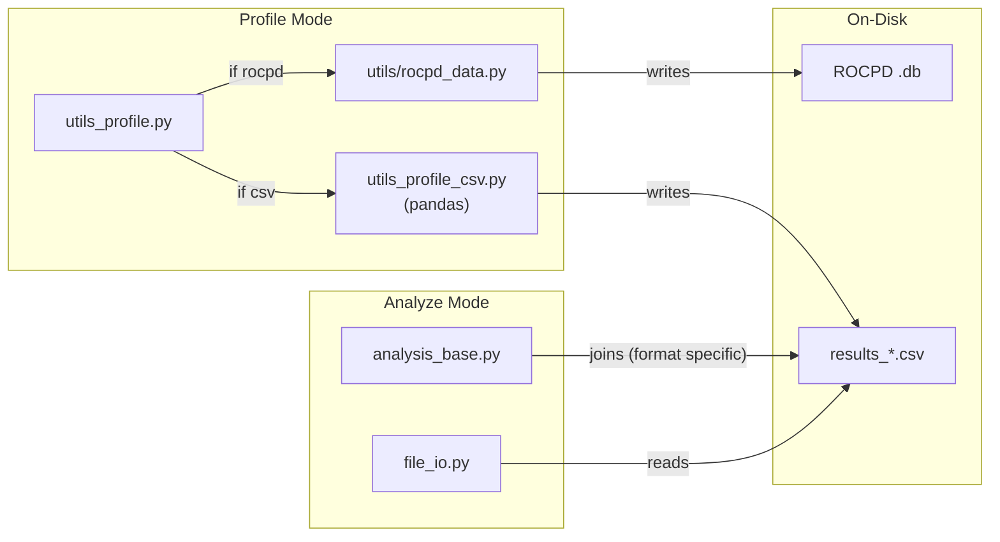
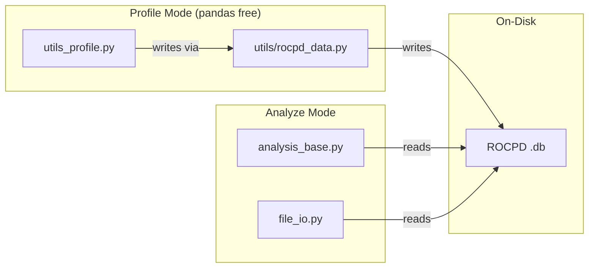
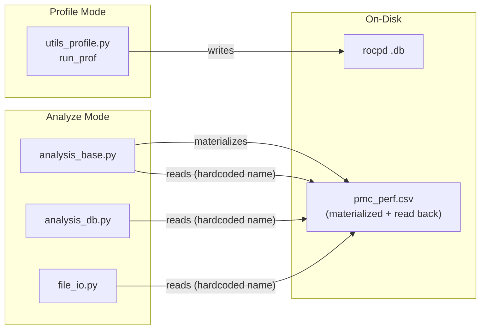
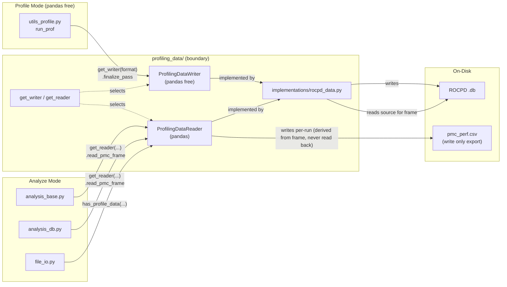
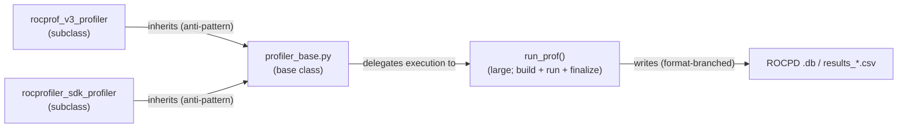
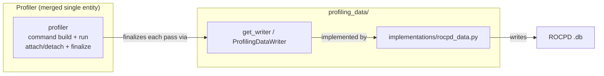
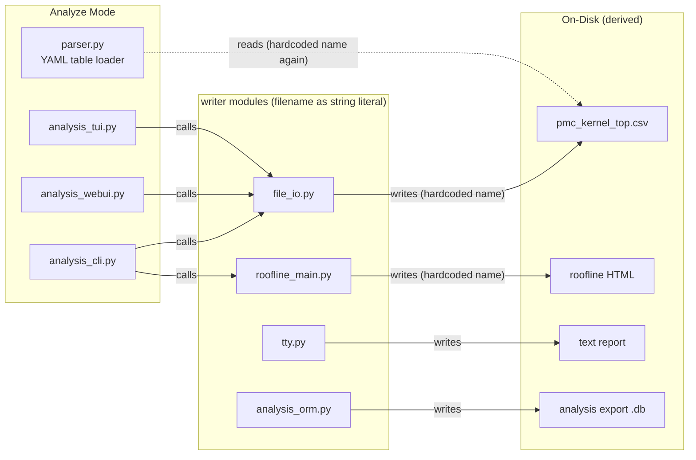
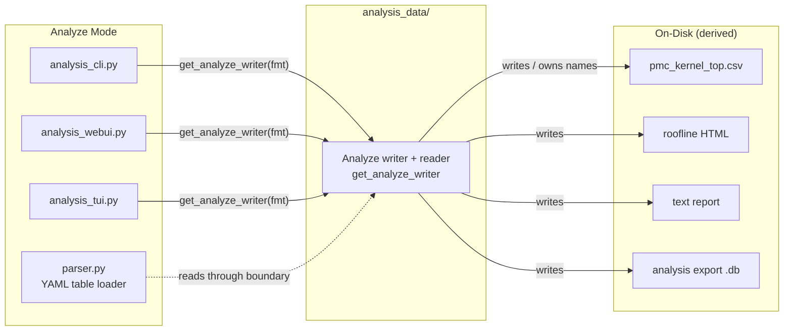

# Profile Interface Architecture

Status: proposal

This document describes the architecture for profile data storage and access in
rocprofiler-compute, and records the decisions made in the design review so the
reasoning behind them is not lost. The goal is to keep storage-format knowledge
in one place behind a clear boundary, so ROCPD, profiler-hub, parquet, or any
future source can be added as a single implementation instead of forcing
profiling, analysis, CLI, TUI, WebUI, and utility code to change with it.

> File names and code locations
> change quickly and should not be treated as final, also "Before" diagrams describe the state of
> the develop branch at the time of writing and will become historical once the
> phases are merged to develop.

## Problem

Profile data storage is becoming more varied:

- ROCPD `.db` is becoming the default and canonical profile output.
- The native tool writes counter data directly into a SQLite/ROCPD database via
  profiler-hub.
- Parquet is a possible future option for large workloads.

Today the writing, reading, joining, and pivoting of profile data are thinly
spread across many modules. On-disk file names are hardcoded in multiple places,
and the same modules mix csv joins, rocpd extraction, and analysis expectations.
Every new storage format therefore touches many unrelated modules, which raises
the cost and risk of each change.

There is also a concrete performance motivation. On large (AI) workloads,
profile and analyze time were dominated by redundant reads, writes, and pivots
of intermediate CSVs over millions of rows. Removing those intermediates and
going straight to an in-memory frame is a primary driver of this work.

## Goal

Put PMC profile data storage behind one boundary with a clear reader and writer
contract:

- Profile mode finalizes data through a **writer**.
- Analyze mode reads data through a **reader** that returns the in-memory frame.
- No other module knows whether the source is ROCPD, profiler-hub, or a future
  format, and no other module knows where or how it is stored on disk.

Adding a new storage format should mean adding one implementation behind the
boundary and extending one selection point — not editing profiling, analysis,
and utility code.

## Architectural Decisions (AD)

Each decision below is recorded with its rationale and consequences

### AD-1: Remove the CSV profile backend

The CSV profile backend (`results_*.csv` output and the
profile-side CSV code path) is removed and rocpd becomes the canonical profile
source. Backward compatibility for ROCm versions older than 7.0 (which come before
rocpd support) is _intentionally_ not carried forward in profile mode.

Keeping csv forces two parallel storage implementations with
different dependencies, requires "not supported in CSV" warnings to be sprinkled
across every new feature, and increases the complexity the boundary must
abstract. Also csv to rocpd is a lossy conversion so a back conversion is not a real
substitute for native rocpd.

Users on ROCm < 7.0 use an older rocprof-compute
release to profile and analyze those workloads; a new release is not expected to
analyze data produced by an old, unsupported profiler and also we have a deprecation notice. IF a hard CSV requirement ever returns, the
boundary makes it cheap to add back as one implementation.

### AD-2: Remove the rocprofv3 backend so rocprofiler-sdk is the lone backend

Counter collection is ultimately performed by the SDK tool in
both cases, so v3 only adds a redundant script layer plus legacy csv shaped
analysis handling

Removing v3 deletes a meaningful amount of "fluffy" analysis
code. This is planned in the backend phase (Phase C) together with the
inheritance cleanup in AD-5 because it is a backend execution concern rather
than a profile-data-storage concern.

### AD-3: `pmc_perf.csv` is no longer in the analyze read path

Analyze mode does not read `pmc_perf.csv` anymore, for example instead of going results_*.csv -> pmc_perf.csv -> pandas df we go straight from profile output -> pandas dataframe in memory, basically the reader returns the
pmc DataFrame built directly from the profile source. `pmc_perf.csv` becomes a
**one-way export** (which is written but not read back), so it stays exactly as available
as it is today for users, developers, and tests, nothing in current behavior or
the test suite changes and the file still appears on every analyze run.

Currently, EVERY analyze run materializes `pmc_perf.csv` and then
reads it back, so all profile formats collapse through a CSV regardless of how
they were stored which basically defeats the point of supporting varied storage and adds
large csv pivot cost on big workloads. Any output format reader is forced to also
produce a CSV just so analyze can read it (e.g. rocpd is `.db` -> `results_*.csv`
-> `pmc_perf.csv` -> frame). With `read_pmc_frame` any profile output returns a
frame directly and never round-trips through CSV. `pmc_perf.csv` is an
intermediate not a public contract, so analyze should not depend on it.

The merged frame depends on the user's **analysis filters**,
so a one time materialize and reuse does not work. The reader builds
the frame from source **per analysis run** with filters applied in memory and
the `pmc_perf.csv` export is derived from that frame.

Making the export itself optional/opt-in, so users who do not need it do not pay
the cost of producing it on large workloads, is a deferred follow-up and not part
of this change.

### AD-4: One profiler backend, modeled as a single entity

rocprofiler-sdk is the only backend, modeled as a single cohesive
profiler entity rather than a base class with one subclass. No separate
orchestration/collector layer is introduced.

With one backend there is nothing to abstract across, so a single
entity is simpler and if a second collector is
added later for whatever reason, an interface can be extracted at that point.

### BOUNDARIES in these ADs to mention:
#### Unit tests do not touch disk

Disk I/O lives behind a thin, transparent adapter (like 
header/row write primitives) that is intentionally left untested. Unit tests
mock the writer/reader and assert on what is passed rather than writing or
reading real files.

Tests that write to disk leave stray artifacts when they crash,
can exhaust CI storage, and depend on system resources. The boundary makes
disk free testing natural as in the same writer interface that production uses is
swapped for an in memory fake in tests

#### No pandas in profiling

Already discussed at length and merged to current develop pipline, this boundary has to be respected in this design as well as in profiling code must not depend on pandas or other analysis only
dependencies. The boundary exposes a **writer** used by
profiling (pandas-free) and a **reader** used by analysis (pandas is fine here), packaged
together but with different dependency characteristics.

Profiling and analysis have different runtime constraints and leaking
heavy analysis dependencies into the profile path is not acceptable. What makes this much cleaner is removing the
csv profile backend (AD-1) because the profile-side CSV
helper that pulled in analysis style handling goes away

## Phasing and Acceptance

Phase order: A (remove CSV) -> B (`profiling_data` boundary) -> C (backend
execution) -> D (`analysis_data` boundary), plus follow-ups. Once Phase A lands,
B, C, and D have no hard ordering dependency on each other.

## Phase A: Remove the CSV Profile Backend

CSV removal comes first because it shrinks everything downstream: there is no
second storage format to hide behind the boundary, and profiling stays
pandas free. This phase does not introduce the boundary yet it just deletes
the CSV profile path and the dependencies it dragged in.

### Before

### Target

The `if csv` branch, `results_*.csv`, and the pandas-dependent `utils_profile_csv.py`
are removed. Profile mode no longer chooses a storage format.

## Phase B: The Profiling Data Boundary

The boundary owns where PMC profile source data lives and how it is read/written, and exposes two contracts:

- `ProfilingDataWriter.finalize_pass(context)` which records a completed profiling
  pass at the end of profile mode (pandas free)
- `ProfilingDataReader.read_pmc_frame(workload_dir, filters)` which returns the pmc
  df built from source for its respective analysis run
- `ProfilingDataReader.has_profile_data(workload_dir)` which reports whether readable
  profile data exists so callers stop string matching for specific and hardcoded file names.

Callers obtain an implementation through selection functions rather than
constructing implementations directly:

- `get_reader(profiling_config, options)` returns the correct reader.
- `get_writer(format)` returns the correct writer.

This is the only place that maps a configured format to an implementation.

### Before

### Target

The reader reads its storage implementation, normalizes source specific rows into
the PMC DataFrame, applies the analysis filters in memory, and returns the frame.
Analyze callers never branch on storage format, construct file paths, or read
`pmc_perf.csv`.

> The diagrams show only the PMC counter data path which is all this boundary
> moves. A workload directory contains many other files (`roofline.csv`, traces,
> `sysinfo.csv`, `profiling_config.yaml`, perfmon configs, and derived analyze
> outputs). They are deliberately left unchanged here you may see
> [Data Ownership](#data-ownership).

## Phase C: Backend Execution

Backend execution which controls command construction, environment setup, attach/detach,
subprocess execution, and pass finalization is separate from profile data
storage. This phase removes rocprofv3 (AD-2) and merges the backend into a
single profiler entity.

Today `profiler_base` is a base class with `rocprof_v3_profiler` and
`rocprofiler_sdk_profiler` as subclasses, and the bulk of execution lives in a
very large `run_prof` function. With v3 gone there is a single backend, so the
two are merged into one cohesive profiler entity that finalizes each pass through
the writer from Phase B.

### Before

### Target

## Phase D: Analyze-Data Boundary

The boundary above covers profile *source* data. Analyze mode also produces its
own derived files (`pmc_kernel_top.csv`, `pmc_dispatch_info.csv`, roofline HTML,
text reports, the analysis export `.db`), and today each is written with a
hardcoded name in the code that produces it — and the same names are hardcoded
again on the read-back side. This deserves its own boundary so analyze-output
location and format knowledge does not spread the way profile-data knowledge did.

`analysis_data/` is symmetric with `profiling_data/`: `profiling_data/` owns
where profile *source* data lives; `analysis_data/` owns where analyze-*derived*
outputs go. It is a writer/reader for derived outputs not a storage format
implementation.

### Before

### Target

## Data Ownership

Not every file in a workload directory is profile data. Keeping the boundary
intact means classifying each file by owner.

| Class | Examples | Owner | Behind the profiling-data boundary? |
| --- | --- | --- | --- |
| Raw profile source data (PMC) | ROCPD `.db`, future parquet | `profiling_data/implementations/` | **Yes** — only the boundary knows the layout and conversion rules |
| Removed legacy profile data | `results_*.csv` | — (removed, AD-1) | n/a |
| Exported artifact | `pmc_perf.csv` | `ProfilingDataReader` export (AD-3) | **Write-only** — derived from the in-memory frame and written every analyze run; never read back; not a public contract. Making production opt-in is a follow-up |
| Profile-time non-PMC data | `roofline.csv` (empirical ceilings) | roofline / SoC code | No — not PMC counters |
| Profile metadata / config | `profiling_config.yaml`, `sysinfo.csv`, `perfmon/pmc_perf_*.yaml` | Profile mode | No — `profiling_config.yaml` is *read* by `get_reader` to select the impl, but is not owned data |
| Trace data | `*_marker_api_trace.csv`, `torch_trace_*.csv`, PC sampling json | Profile / trace code | No — out of scope |
| Derived analyze artifacts | `pmc_kernel_top.csv`, `pmc_dispatch_info.csv`, roofline HTML, text report, analysis export `.db` | `analysis_data/` (Phase D) | No — separate boundary |

## Testing Architecture (AD-6)

- Unit tests must not read or write the real filesystem.
- Disk serialization sits behind a thin adapter (e.g. write-header / write-row
  primitives) that is intentionally transparent and left uncovered, because it is
  just a passthrough to a third-party library or the filesystem.
- The writer/reader contracts are mocked in unit tests; tests assert on what the
  model passed to the writer (rows, headers, finalize calls) rather than
  inspecting files.
- Only the thin disk adapters and end-to-end / integration tests touch disk.
- Refactoring the boundary will require updating existing unit tests that
  currently write scratch files; this is expected.

## Known Gaps

These remain after the boundary lands; they do not block it.

1. Post-pass profiling work (application replay, the roofline benchmark) runs
   after the counter passes complete. The writer's finalize step must accommodate
   this phase, or it is explicitly a backend concern outside the data boundary;
   to be confirmed in Phase C.
2. PC-sampling analyze reads JSON produced by profile mode. That is another
   format that should eventually sit behind a similar boundary (likely a JSON
   implementation); noted for future scope.

## Success Criteria

The design is working when:

- Profile mode does not decide or know the storage layout, and does not depend on
  pandas
- Analyze mode can ask for a pmc DataFrame without knowing what the source is and without reading `pmc_perf.csv`.
- `pmc_perf.csv` is written as a one-way export derived per run, and analyze no
  longer reads it back. This saves a lot of csv processing especially on large workloads.
- Workload availability checks go through `has_profile_data()` rather than probing
  for specific files
- Storage-format conditionals are isolated to `get_reader` / `get_writer` and the
  implementations
- Adding a new profile source primarily means adding one implementation and
  extending selection in one place (high locality of change)
- The boundary can be exercised in unit tests without touching disk
